# CompyAgent Codebase Review

Date: July 7, 2026

## Scope

This review covers the current server-side CompyAgent architecture under `Src/Server`, including the data-first simulation runtime, GOAP planning and execution, team blackboards, Studio-authored level integration, humanoid model support, spatial perception, movement adapters, combat, visualization, and Roblox-native tests.

No implementation changes are included in this review document.

## Executive Summary

The codebase is organized around a single authoritative `Simulation` object that owns data stores, blackboards, adapter selection, budget queues, scheduled scans, and runtime systems. The overall architecture is aligned with the project goal: server-side, data-first GOAP agents with swappable grid and spatial adapters.

The strongest parts of the current design are the clear separation between simulation data and Roblox Instances, the central `Types.luau` contract file, bounded work queues, modular GOAP actions, adapter interfaces, and the emerging Studio/NoobPath path toward more realistic 3D behavior.

The main issues found are integration issues rather than architecture issues. The modular goals registry currently disables most goals, spatial combat line-of-sight can be blocked by agent/debug Instances, the debug average-frame remote can divide by zero before the first frame, and `NoobPathMovement` still has a few untyped `any` surfaces.

## Review Findings

### P1: Modular GOAP goals registry only loads one goal

File: `Src/Server/GOAP/Goals/init.luau`

The registry only registers `SearchEnemyPosition`; `Survive`, `PressureVisibleEnemy`, and `Hold` are commented out. Since `PlanningSystem` builds candidate goals from this registry, agents currently lose visible-enemy attack goals, low-health survival behavior, and fallback hold behavior.

Impact:

- Agents may fail to attack visible enemies through GOAP.
- Low-health agents may not retreat.
- Agents may have no fallback goal when no enemy sighting exists.

Recommended fix:

Restore all four goal modules in the `GOALS` table and add a focused test that verifies `Goals.BuildCandidateGoals` returns the expected sorted candidates for visible enemy, low health, known enemy, and no-enemy states.

### P1: Spatial combat line-of-sight is unfiltered

Files:

- `Src/Server/Adapters/World/SpatialWorldQuery.luau`
- `Src/Server/Systems/CombatSystem.luau`
- `Src/Server/Adapters/Sensors/RaycastSensor.luau`

`SpatialWorldQuery:HasLineOfSight` performs a raw `Workspace:Raycast` with no filter. `CombatSystem` depends on this method before applying damage. In spatial mode, the ray can be blocked by agent models or debug visualization geometry.

`RaycastSensor` already builds raycast params that exclude agent model and visualization folders, so combat should use a similar filter or share a world-query filtering helper.

Impact:

- Agents may see enemies but fail to damage them.
- Debug visualization or humanoid body parts can accidentally block combat.
- Spatial mode behavior may appear inconsistent with perception.

Recommended fix:

Move filtered raycast construction into `SpatialWorldQuery`, or pass model/debug exclusions into it. Keep perception and combat using consistent line-of-sight rules.

### P2: Debug average-frame remote can divide by zero

File: `Src/Server/Core/Simulation.luau`

`DebugAverageFrameMS.OnServerInvoke` returns `frameTimeMSTotal / framesPassed * 1000`. If the client invokes this remote before the first simulation frame, `framesPassed` is zero.

Impact:

- The client debug UI can receive invalid numeric output before simulation has stepped.

Recommended fix:

Return `0` when `framesPassed == 0`, or defer the remote result until at least one frame has been recorded.

### P3: NoobPath adapter still uses `any`

File: `Src/Server/Adapters/Movement/NoobPathMovement.luau`

The NoobPath movement adapter uses `any` for `pathAgent`, signal arguments, and error type handling. This does not block runtime behavior, but it conflicts with the project convention of explicit typed Luau contracts.

Impact:

- The adapter boundary is weaker than the rest of the server modules.
- Future NoobPath integration mistakes are less likely to be caught by tooling.

Recommended fix:

Define a narrow local protocol type for the NoobPath object and typed signal surface. Use `string` for known error/trap types where practical, and only widen types when the package truly requires it.

## Architecture Summary

### Runtime ownership

`Simulation` is the root runtime object. It owns:

- `AgentStore`
- per-team `BlackboardStore` instances
- `AgentModelStore`
- `StudioWorldRegistry`
- `Scheduler`
- bounded `BudgetQueue` instances
- active adapter bundle
- runtime systems

This keeps the simulation centralized as a runtime coordinator while preserving decentralized agent decision-making through per-agent GOAP planners and shared blackboard facts.

### Data-first agent model

Agents are plain data records created through `AgentState`. Systems mutate these records instead of searching Workspace. Roblox Instances are treated as representation and adapter state, primarily through `AgentModelStore` and `VisualizationSystem`.

### GOAP flow

Planning flow:

1. `PlanningSystem` scans agents that need plans.
2. It builds symbolic facts through `Goals.BuildFacts`.
3. It builds candidate goals through `Goals.BuildCandidateGoals`.
4. It pulls available actions from `Actions.GetAvailableActions`.
5. It calls `Planner.Plan`.
6. Successful plans are assigned with `PlanExecutor.AssignPlan`.

Execution flow:

1. `Simulation:Step` calls `PlanExecutor.StepAll`.
2. `PlanExecutor` gets each agent's current action.
3. It creates an `AgentController`.
4. Action lifecycle hooks write movement, combat, cover, and replan requests onto the agent record.
5. Systems consume those requests.

### Blackboard coordination

`BlackboardStore` holds team-local shared memory:

- enemy sightings
- reservations
- intents
- danger zones

This supports decentralized coordination without an omniscient commander. Agents still own their local planning, but they can react to shared team facts.

### Adapter boundary

The project has clear adapter interfaces:

- `SensorAdapter`
- `MovementDriver`
- `PathProvider`
- `WorldQueryAdapter`

Current implementations include:

- grid sensor and raycast sensor
- grid movement, pathfinding movement, and NoobPath movement
- grid pathfinder, Roblox pathfinder, and Noop pathfinder
- grid world query and spatial world query

This is the right shape for starting with grid/dots and later swapping into Studio-authored 3D environments.

### Studio and humanoid integration

`StudioWorldRegistry` snapshots tagged Studio-authored objects:

- `CompySpawn`
- `CompyCover`
- `CompyObjective`
- `CompyHumanoid`

`AgentModelStore` and `AgentModelFactory` create humanoid-backed models for agents. They can clone tagged Studio humanoid models or fall back to generated shell models.

This allows the simulation to remain data-first while movement, perception, combat origin points, and visualization can be backed by Roblox humanoid Instances.

## UML Class Diagram

```mermaid
classDiagram
    class Simulation {
      +Start()
      +Step(dt)
      -spawnDemoAgents(count)
      -registerCadence()
    }

    class Scheduler {
      +RegisterQueue(name, queue)
      +Every(name, interval, callback)
      +Step(context)
    }

    class BudgetQueue {
      +Enqueue(job)
      +Process(context)
      +Length()
    }

    class AgentStore {
      +Add(agent)
      +Get(id)
      +GetAll()
      +GetTeam(teamId)
    }

    class Agent

    class BlackboardStore {
      +RecordEnemySighting(contact, now)
      +GetBestEnemySighting()
      +Reserve(resourceId, ownerId, now, duration)
      +PublishIntent(ownerId, intent, now, duration)
      +Cleanup(now)
    }

    class AgentModelStore {
      +CreateForAgent(agent, cframe)
      +GetHead(agentId)
      +SyncModelToAgent(agent)
      +DestroyAll()
    }

    class StudioWorldRegistry {
      +Refresh()
      +GetSpawnPoints(teamId)
      +GetCoverPoints(teamId)
      +GetObjectives(teamId)
      +GetHumanoidModels(teamId)
    }

    class PerceptionSystem {
      +Scan(now)
    }

    class PlanningSystem {
      +Scan(now)
    }

    class PathSystem {
      +Scan(now)
    }

    class MovementSystem {
      +Step(dt, now)
    }

    class CombatSystem {
      +Step(dt, now)
    }

    class BlackboardSystem {
      +EnqueueCleanup(now)
    }

    class VisualizationSystem {
      +Initialize()
      +Step(dt, now)
    }

    class Planner {
      +Plan(facts, goalFacts, actions, options)
    }

    class PlanExecutor {
      +AssignPlan(agent, goal, result, now)
      +StepAll(deps, dt, now)
    }

    class AgentController {
      +MoveForAction(actionId)
      +LookAtPosition(position, dt)
      +ShootAtTarget(agentId)
      +RequestPlan(now, reason)
    }

    class SensorAdapter {
      <<interface>>
      +Sense(agent, worldQuery, store, blackboard, now)
    }

    class MovementDriver {
      <<interface>>
      +SetPath(agent, path)
      +Step(agent, dt)
    }

    class PathProvider {
      <<interface>>
      +FindPath(agent, destination, worldQuery, now)
    }

    class WorldQueryAdapter {
      <<interface>>
      +ClampToWorld(pos)
      +HasLineOfSight(a, b)
      +ResolveActionDestination(agent, action, blackboard)
    }

    class GridSensor
    class RaycastSensor
    class GridMovement
    class PathfindingMovement
    class NoobPathMovement
    class GridPathfinder
    class RobloxPathfinder
    class NoopPathfinder
    class GridWorldQuery
    class SpatialWorldQuery

    Simulation *-- Scheduler
    Simulation *-- AgentStore
    Simulation *-- AgentModelStore
    Simulation *-- StudioWorldRegistry
    Simulation *-- BlackboardStore
    Simulation *-- PerceptionSystem
    Simulation *-- PlanningSystem
    Simulation *-- PathSystem
    Simulation *-- MovementSystem
    Simulation *-- CombatSystem
    Simulation *-- BlackboardSystem
    Simulation *-- VisualizationSystem

    Scheduler o-- BudgetQueue
    AgentStore o-- Agent

    PlanningSystem --> Planner
    PlanningSystem --> PlanExecutor
    PlanExecutor --> AgentController
    AgentController --> Agent
    AgentController --> BlackboardStore
    AgentController --> WorldQueryAdapter

    PerceptionSystem --> SensorAdapter
    PathSystem --> PathProvider
    PathSystem --> MovementDriver
    MovementSystem --> MovementDriver
    CombatSystem --> WorldQueryAdapter
    CombatSystem --> AgentModelStore
    VisualizationSystem --> AgentModelStore

    SensorAdapter <|.. GridSensor
    SensorAdapter <|.. RaycastSensor
    MovementDriver <|.. GridMovement
    MovementDriver <|.. PathfindingMovement
    MovementDriver <|.. NoobPathMovement
    PathProvider <|.. GridPathfinder
    PathProvider <|.. RobloxPathfinder
    PathProvider <|.. NoopPathfinder
    WorldQueryAdapter <|.. GridWorldQuery
    WorldQueryAdapter <|.. SpatialWorldQuery
```

## Recommended Next Steps

1. Restore the full modular GOAP goal registry.
2. Add candidate-goal tests around `Goals.BuildCandidateGoals`.
3. Share or duplicate filtered raycast handling for spatial combat line-of-sight.
4. Guard debug frame metrics before the first frame.
5. Replace `any` in `NoobPathMovement` with a narrow local NoobPath protocol type.
6. Remove or ignore the temporary `CompyAgent.typecheck.rbxlx` build artifact before committing.
