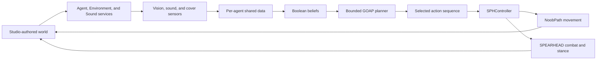

# CompyAgent

CompyAgent is a server-authoritative tactical AI prototype for Roblox. Autonomous R6 agents sense the world, convert observations into beliefs, build short plans with goal-oriented action planning (GOAP), and execute those plans through SPEARHEAD weapon control and NoobPath movement.

The project is focused on readable AI-vs-AI demonstrations rather than a complete tactical simulation. Its current vertical slice covers searching, hearing gunfire, remembering enemy locations, fighting, reloading, and using authored cover.

> [!IMPORTANT]
> This repository contains the CompyAgent code and Rojo mapping, but not a standalone playable place. SPEARHEAD assets, EasyRagdoll, R6 agent templates, and tagged level geometry must exist in Roblox Studio.

## Current capabilities

- Bounded, cost-based GOAP planning with per-agent action instances.
- Directional enemy vision with configurable range, field of view, and raycast occlusion.
- Sound sensing driven by short-lived weapon-fire signals.
- Per-agent short-term memory of previously sighted enemy positions.
- Bravery that recovers over time and resets when the agent takes damage.
- Cover discovery, reservation, movement, hiding, peeking, firing, reloading, and leaving cover.
- NoobPath-backed movement with server network ownership and movement cancellation.
- SPEARHEAD-backed aiming, weapons, firing, reloading, stances, and animation.
- Studio-authored registries for spawns, cover, objectives, rooms, and doors.
- A live React debug panel for inspecting an agent's plan, beliefs, action, controller state, and planner log.

### Feature status

| Area | Status |
| --- | --- |
| Enemy search and engagement | Implemented |
| Directional/FOV vision | Implemented for enemies |
| Gunfire hearing | Implemented |
| Individual enemy memory | Implemented |
| Cover combat | Implemented as a prototype |
| Objective discovery | Registered and sensed; capture goal is disabled |
| Doors | Registered through authored modules; no GOAP door action yet |
| Rooms | Registered with occupancy tracking; no room-clearing behavior yet |
| Shared team blackboard | Not implemented; knowledge is currently per agent |

## How it works



`Simulation` owns the server lifecycle. It starts the module-global services, creates each configured team at Studio spawn points, starts every agent, and performs final teardown. Each `Agent` owns its sensors, modifiers, shared observations, planner state, controller, and Heartbeat cadence.

The planner performs a bounded uniform-cost search. By default, a search expands at most 128 states and produces plans up to six actions deep. Goals are evaluated by priority, then actions are selected by accumulated cost.

### Beliefs, actions, and goals

The active belief set is:

`brave`, `hasAmmo`, `inCover`, `coverAvailable`, `coverInvalid`, `heardEnemyFiring`, `knowsEnemyPos`, and `hasEnemyPos`.

The active action set is:

`FindEnemyLocation`, `InvestigateEnemyFiring`, `InvestigateKnownEnemy`, `EngageEnemy`, `Reload`, `TakeCover`, `LeaveCover`, `FromCoverHide`, `FromCoverPeek`, `FromCoverEngageEnemy`, and `FromCoverReload`.

The only active goal is `AttackEnemy`. Objective capture is future work and is not registered with the planner.

## Repository layout

```text
CompyAgent/
├── Src/
│   ├── Server/
│   │   ├── Agents/                  # Agent runtime, sensors, modifiers, planner adapter
│   │   ├── Core/                    # Simulation, shared server types, utilities
│   │   ├── GOAP/                    # Planner, facts, actions, and goals
│   │   ├── Integrations/Spearhead/  # R6 factory and NPC-facing SPEARHEAD controller
│   │   └── Services/                # Agent, environment, sound, and debug registries
│   ├── Shared/                      # Team definitions, configuration, shared utilities
│   ├── Client/                      # React agent-debug interface
│   └── Character/                   # Play-mode sound-debug input
├── NoobPath/                        # Preserved source copy of NoobPath
├── default.project.json             # Rojo DataModel mapping
├── rokit.toml                       # Pinned development tools
└── wally.toml                       # Shared package dependencies
```

## Getting started

### Prerequisites

- [Roblox Studio](https://create.roblox.com/docs/studio/setup)
- [Rokit](https://github.com/rojo-rbx/rokit)
- The [Rojo Studio plugin](https://create.roblox.com/store/asset/13916111004/Rojo)
- A Studio place containing compatible [SPEARHEAD](https://github.com/Nyemse/SPEARHEAD) assets and the project's R6-compatible `EasyRagdoll` ModuleScript

The pinned command-line tools are Rojo 7.7.0, Wally 0.3.2, Selene 0.31.0, and Wally Package Types 1.6.2.

### 1. Clone and install tools

```powershell
git clone https://github.com/zleodai/CompyAgents.git CompyAgent
Set-Location CompyAgent
rokit install
```

### 2. Install Wally packages

```powershell
wally install
```

Wally manages React, ReactRoblox, and Promise. It may remove the separately preserved NoobPath package. Restore the repository copy when necessary:

```powershell
if (-not (Test-Path .\Packages\NoobPath)) {
    Copy-Item -Recurse .\NoobPath .\Packages\NoobPath
}
```

### 3. Prepare the Studio place

The runtime expects these Studio-authored instances in addition to the Rojo tree:

```text
Workspace
├── CompyAgent
│   └── Models
│       ├── Doge   (archivable R6 character Model)
│       └── Dak    (archivable R6 character Model)
└── SPH
    └── Tools
        ├── AKM
        └── M4A1

ReplicatedStorage
├── EasyRagdoll    (ModuleScript)
└── SPH_Assets
    └── WeaponModels
```

Each agent template must contain a `Humanoid`, `HumanoidRootPart`, `Head`, `Torso`, both arms, and both legs. Team-to-template mappings live in `Src/Shared/Config/TeamConfig.luau`.

### 4. Sync with Rojo

Start the development server from the repository root:

```powershell
rojo serve
```

Connect the Rojo Studio plugin to the server, confirm the tagged level setup below, and start a Studio play session. The default configuration spawns 30 Blue and 30 Red agents, so lower `DemoAgentsPerTeam` before testing on a smaller machine.

## Studio-authored level contracts

`EnvironmentService` discovers tagged instances through `CollectionService`. Tag names can be changed in `Src/Shared/Config/SimulationConfig.luau`.

| Tag | Apply to | Current contract |
| --- | --- | --- |
| `CompySpawn` | `BasePart` | Set `Enabled=true`. Optional attributes: `TeamId`, `SquadId`, `SpawnOrder`, and `SpawnRadius`. A missing `TeamId` matches every team. Simulation requires at least one enabled matching spawn for each team. |
| `CompyCover` | `BasePart` | Add one or more child `BasePart`s named `Pos`. Each `Pos` must contain a `BasePart` named `Dir`; the vector from `Pos` to `Dir` defines the direction toward the protected threat. |
| `CompyObjective` | `BasePart` | Optional attributes: `ObjectiveId`, `TeamId`, and `Radius`. A missing `TeamId` matches every team. |
| `CompyRoom` | `Model` | Add a direct child `ModuleScript` named `Script` that exposes `GetRoom(): string` and `GetAgents(): {string}`. |
| `CompyDoor` | `Model` | Add a direct child `ModuleScript` named `Script` that exposes `Open()`, `Close()`, and `GetRoom(): string`. The Model name is the door ID. |

Spawn parts and cover `Pos`/`Dir` markers are made transparent when registered. Registries also listen for tagged instances added or removed while the simulation is running.

### Room module example

```luau
local Room = {}

function Room.GetRoom(): string
    return "Lobby"
end

function Room.GetAgents(): { string }
    -- Return the names of agents currently inside this room.
    return {}
end

return Room
```

### Door module example

```luau
local Door = {}

function Door.Open(): ()
    -- Animate the authored door and update collision here.
end

function Door.Close(): ()
    -- Reverse the authored door state here.
end

function Door.GetRoom(): string
    return "Lobby"
end

return Door
```

These modules register world semantics only. The current GOAP action registry does not call door modules or coordinate room clearing.

## Configuration

| File | Controls |
| --- | --- |
| `Src/Shared/Config/AgentConfig.luau` | Health, memory, bravery, vision, hearing, cover, engagement, and controller tuning |
| `Src/Shared/Config/CadenceConfig.luau` | Sensor and planner update intervals |
| `Src/Shared/Config/NoobPathConfig.luau` | Pathfinding agent parameters, partial paths, precision, and visualization |
| `Src/Shared/Config/SimulationConfig.luau` | Team population, tags, service cadence, debug logging, and sound lifetime |
| `Src/Shared/Config/TeamConfig.luau` | Team IDs, colors, facing, and model template pools |
| `Src/Shared/Config/TestConfig.luau` | Reserved test-mode flags; disabled by default |

## Debugging

During a play session, click a live agent character to open the agent debug panel. Click the same agent again, click another agent, or use the panel's close button to dismiss it. The panel refreshes the selected agent's planner log and runtime dump every 0.1 seconds.

Press `F` while controlling a player character to emit a synthetic enemy-fire signal at the player's head position. This is intended for testing agent hearing and investigation behavior.

Useful character attributes include `SPHStance`, `SPHGait`, `SPHAmmo`, `SPHReserveAmmo`, `SPHPathError`, `SPHPathRepathCount`, and `SPHPathRepathReason`.

## Validation

Run the static and Rojo checks from the repository root:

```powershell
selene Src
rojo sourcemap default.project.json --output sourcemap.json
rojo build default.project.json --output "$env:TEMP\CompyAgent-validation.rbxlx"
```

Static checks do not validate SPEARHEAD assets, R6 animations, authored tags, path traversal, or live GOAP behavior. Use a fresh Roblox Studio play session for those integration checks.

## Packages and credits

- [SPEARHEAD](https://github.com/Nyemse/SPEARHEAD) by Nyemse — weapon assets and the combat system adapted by `SPHController`.
- [NoobPath](https://devforum.roblox.com/t/noobpath-easy-pathfinding/3254514) by grewsxb4 — character pathfinding; the preserved v1.811 source is MIT-licensed.
- EasyRagdoll by theonlyflare — agent death ragdoll behavior supplied by the Studio place.
- [Promise](https://github.com/evaera/roblox-lua-promise) by evaera — asynchronous controller operations.
- [React Lua](https://github.com/jsdotlua/react-lua) and ReactRoblox — client debug interface.
- [Rojo](https://rojo.space/), [Wally](https://wally.run/), [Rokit](https://github.com/rojo-rbx/rokit), and [Selene](https://kampfkarren.github.io/selene/) — project sync, dependency management, toolchain management, and linting.

Third-party packages and Studio assets remain subject to their respective licenses.

## License

CompyAgent does not currently include a project-level license. Unless a license is added, no permission to copy, modify, or redistribute the original project code is granted. Third-party components retain their own license terms.
